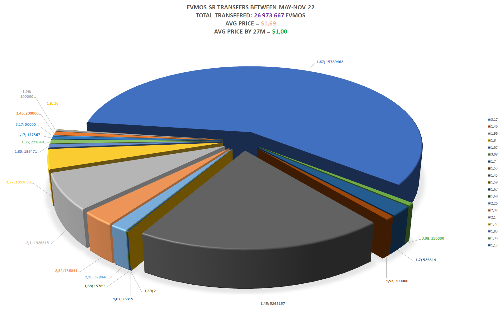

There are results of my research of Evmos accounts *

**Read the DISCLAIMER*

# DISCLAIMER

**The information provided by me in this repository/research is for general informational purposes only. All information in the repository/research is provided in good faith, however, I make no representation or warranty of any kind, express or implied, regarding the accuracy, adequacy, validity, reliability, availability, or completeness of any information in the repository/research.**

**Under no circumstance should I have any liability to you for any loss or damage of any kind incurred as a result of the use of the repository/code/research or reliance on any information provided in the repository/research.**

**Your use of the repository/research and your reliance on any information in the repository/research is solely at your own risk.**

# Research files, codes, structure

## Folders

- [evmos-genesis-parser](./evmos-genesis-parser/) folder contains the source code of the Evmos mainnet genesis parser, which exports some useful data (bot all) to SQLite 3 database file
- [EvmosTransactionsParser](./EvmosTransactionsParser/) folder contains the source code of the Evmos transactions parsed, the output of `evmosd txs ...` command, from json to csv

## Command to export transactions to json:

```
.\evmosd.exe q txs --events "message.sender=evmos1z8ynrnhdn4l69mu6v6ckjr4wukcacd0e7j0akn&message.action=/cosmos.bank.v1beta1.MsgSend" --page 1 --limit 1000 --node https://tendermint.bd.evmos.org:26657 -o json > .\evmos-sr-transfers.json
```

## Files

- [evmos-sr-transfers.json](./evmos-sr-transfers.json) is exported transactions data in JSON format
- [evmos-sr-transfers.csv](./evmos-sr-transfers.csv) is exported transactions data in CSV format
- [evmos-private-sale.xlsx](./evmos-private-sale.xlsx) is the summarization tables of EVMOS token movement based on transactions and genesis data in XLSX format
- [evmos-sr-transfers.png](./evmos-sr-transfers.png) is the summary pie chart of the Evmos SR account transfers in PNG format

## Summary

